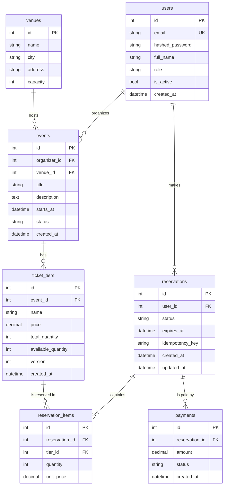

# ER Diagram

```mermaid
erDiagram
    users ||--o{ events : organizes
    venues ||--o{ events : hosts
    events ||--o{ ticket_tiers : has
    users ||--o{ reservations : makes
    reservations ||--|{ reservation_items : contains
    ticket_tiers ||--o{ reservation_items : "is reserved in"
    reservations ||--o{ payments : "is paid by"

    users {
        int id PK
        string email UK
        string hashed_password
        string full_name
        string role
        bool is_active
        datetime created_at
    }
    venues {
        int id PK
        string name
        string city
        string address
        int capacity
    }
    events {
        int id PK
        int organizer_id FK
        int venue_id FK
        string title
        text description
        datetime starts_at
        string status
        datetime created_at
    }
    ticket_tiers {
        int id PK
        int event_id FK
        string name
        decimal price
        int total_quantity
        int available_quantity
        int version
        datetime created_at
    }
    reservations {
        int id PK
        int user_id FK
        string status
        datetime expires_at
        string idempotency_key
        datetime created_at
        datetime updated_at
    }
    reservation_items {
        int id PK
        int reservation_id FK
        int tier_id FK
        int quantity
        decimal unit_price
    }
    payments {
        int id PK
        int reservation_id FK
        decimal amount
        string status
        datetime created_at
    }
```
